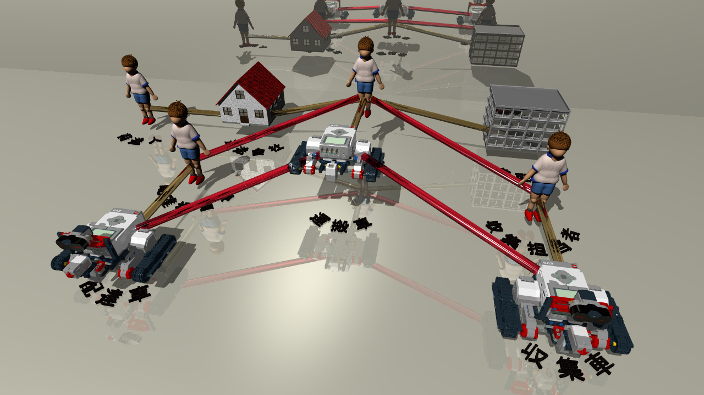

# povastah
A Tool of UML Diagram visualization by POVRay Scene Description Laungage
- クラス図
-- クラス継承階層を立体表現する
-- ロバストネス図表現対応(インスタンス仕様も含む)
- ステートマシン図
-- サブマシン状態をそのステートマシン図によって入れ子構造表現する
- アクティビティ図
-- 振る舞い呼び出しアクションをそのアクティビティ図によって入れ子構造表現する
- Fork-Join構造表現
-- アクティビティ図、ステートマシン図のFork-Join構造を高低差で表現する。

## Demo

簡易例題 astah*プロジェクト([examples/povastah.asta](./examples/povastah.asta))

※[UML要素とPOVRayオブジェクトの対応](./includes/README.md)

<details>
<summary>クラス図</summary> 

<table>
<thead><tr><th></th><th>astah</th><th>POVRay</th></tr></thead>
<tbody>
<tr><td>クラスとインタフェース</td>
<td></td>
<td></td></tr>

<tr><td>関連クラス</td>
<td></td>
<td></td></tr>

<tr><td>ロバストネス図<br>with インスタンス仕様</td>
<td></td>
<td></td></tr>

<tr><td>インタフェース継承階層</td>
<td></td>
<td></td></tr>

<tr><td>クラス継承リンクグループ</td>
<td></td>
<td></td></tr>
</tbody>
</table>
</details>

<details>
<summary>コミュニケーション図</summary> 

<table>
<thead><tr><th></th><th>astah</th><th>POVRay</th></tr></thead>
<tbody>
<tr><td>MVCコミュニケーション</td>
<td></td>
<td></td></tr>
</tbody>
</table>
</details>

<details>
<summary>ユースケース図</summary> 
<table>
<thead><tr><th></th><th>astah</th><th>POVRay</th></tr></thead>
<tbody>
<tr><td>ユースケース</td>
<td></td>
<td></td></tr>
</tbody>
</table>
</details>

<details>
<summary>アクティビティ図</summary> 

<table>
<thead><tr><th></th><th>astah</th><th>POVRay</th></tr></thead>
<tbody>
<tr><td>ライフサイクル</td>
<td></td>
<td></td></tr>
<tr><td>ムーブメント</td>
<td></td>
<td></td></tr>
<tr><td>ライフ<br>「ムーブメント」呼び出し</td>
<td></td>
<td></td></tr>
</tbody>
</table>
</details>

<details>
<summary>ステートマシン図</summary> 

<table>
<thead><tr><th></th><th>astah</th><th>POVRay</th></tr></thead>
<tbody>
<tr><td>リスト画面<br>内部状態-横2</td>
<td></td>
<td></td></tr>
<tr><td>エンティティ画面<br>(「リスト画面」呼び出し)</td>
<td></td>
<td></td></tr>
<tr><td>トップページ<br>(「エンティティ画面」呼び出し)</td>
<td></td>
<td></td></tr>
</tbody>
</table>
</details>

<details>
<summary>各種表現</summary> 

<table>
<thead><tr><th></th><th>astah</th><th>POVRay</th></tr></thead>
<tbody>
<tr><td>Fork-Join構造</td>
<td></td>
<td></td>
<tr><td>不正オブジェクト</td>
<td></td>
<td></td>
</tbody>
</table>
</details>

<details>
<summary>Practice</summary>

<table>
<thead><tr><th>astah</th><th>POVRay</th><th>Customize</th></tr></thead>
<tbody>
<td></td>
<td></td>
<td></td></tr>
</tbody>
</table>
</details>

## Requirement
実行環境
- [astah\* professinal, astah\* UML](https://astah.change-vision.com/ja/)
- [The Persistence of Vision Raytracer version 3.7](http://www.povray.org/)

ビルド環境
- [AdaptOpenJDK jdk-8.0.292](https://adoptopenjdk.net/index.html)
- [astah-plugin-SDK-1.5](https://astah.change-vision.com/files/plugin/astah-plugin-sdk-latest.zip)
	- [astah*プラグイン開発チュートリアル](https://astah.change-vision.com/ja/tutorial/plugin.html)
	- conf/settings.xmlを修正しないとastah-buildコマンドがエラーになる。
		- [Mavenのcentralリポジトリへのアクセス制限によるastah*プラグインSDKのエラー](https://ja.astahblog.com/2020/03/05/astah%e3%83%97%e3%83%a9%e3%82%b0%e3%82%a4%e3%83%b3sdk%e3%81%ab%e3%81%8a%e3%81%91%e3%82%8b%e3%83%aa%e3%83%9d%e3%82%b8%e3%83%88%e3%83%aa%e3%82%a2%e3%82%af%e3%82%bb%e3%82%b9%e6%99%82%e3%81%ae%e3%82%a8/)
	- astah-generate-projectコマンドでastah*プラグイン開発Mavenプロジェクトを生成した際のpom.xmlに`<systemPath>${astahPath}/astah-api.jar</systemPath>`の行がある。SDKのconf/settings.xmlで`${astahPath}`の値が定義されているが、pom.xmlに反映されていない。`astah-api.jar`をライブラリに追加するために、pom.xmlの`properites`に、`${astahPath}`の定義を加える必要がある。
	- Java環境がOracle JDK1.8の場合、astah* 8.4以降astah-launchコマンド実行で、Javaバージョンが合わず、-nojvchkオプションを加えろとダイアログが出て終了する。
	  - Oracle JDK1.8は、1.8.0_291が最終ですが、astah* 8.4はAdaptOpenJDK jdk-8.0.292以降を要求する。
	    1. AdaptOpenJDK jdk-8.0.292をインストールする。
	    2. 環境変数JAVA_HOMEをAdaptOpenJDKのインストールディレクトリに設定する。
	    3. 環境変数PATHに、"%JAVA_HOME%\bin"を設定する。

## Install
- [target/povastah-X.X-SNAPSHOT.jar](./target/povastah-1.1-SNAPSHOT.jar) をastah*ツールのインストールディレクトリ配下のpluginsディレクトリに配置する。
- [includes](./includes)配下のインクルードファイル"povastah.inc", "umlTexture.inc", "povastahParts.inc"をPOVRayのインクルードファイルディレクトリに配置する。
	- POVRay v3.7 デフォルト環境ディレクトリ(インストール時に指定可能)
		- 配下に、include(インクルードファイルディレクトリ), ini(デフォルオ設定ファイルディレクトリ)等がある。
		- Windows版: My Documents\POV-Ray\v3.7
		- Linux版:  /usr/local/share/povray-3.7
	- ini/povray.iniを編集して、インクルードファイルディレクトリを追加する。
		- Windows版 ```Top Menu[Tools]->[Edit master POVRAY.INI]```で開いて編集する。
			```Shell
			Library_Path="Y:\povray\include"
			```

プラグインツール
- [ツール]→[画像出力]→[POVRayスクリプト]で、出力ディレクトリを指定する。

## Usage

1. astah*ツールを起動して、3DCG視覚化するダイアグラムを含むプロジェクトを開く。
2. astah*ツールで、POVRayスクリプトファイル(.pov)を作成する。
	- Top Menu[ツール]->[画像出力]->[POVRayスクリプト]を選択する。
	- [POVRay出力]ファイルダイアログで出力ディレクトリを選択する。
    	- POVRayスクリプトファイルはastah*プロジェクト構造と同型のファイルツリー構造に展開される。
3. POVRayツールで、POVRayスクリプトファイル(.pov)を開いて、レンダリングする。
4. POVRayスクリプトファイルを編集する。

	<details>
	<summary>カメラを操作する</summary>
	
	- カメラの配置を変更する
		```POV-Ray SDL
		#declare EYE = <x,y,z>;
		```
		- ｘは水平軸で右手が正である。yは垂直軸で上手が正である。ｚはxy平面の直交軸で奥向きが正である。
		- ステージ平面は、<0,0,32>に配置している。したがって、z>32には配置しない。
	 	
	- カメラの焦点を変更する
		```POV-Ray SDL
		#declare FOCUS = <x,y,z>;
		```
	- カメラをズームする
		```POV-Ray SDL
		camera { location EYE direction 倍率*z look_at FOCUS }
		```		
   </details>		
   <details>
	<summary>リンク影のマテリアルを切り替える</summary>

	```POV-Ray SDL
	#declare ShadowType=1;
	```
   </details>
   <details>
	<summary>ノードオブジェクトの位置を動かす</summary>

	```POV-Ray SDL
	#local Action0_1 = <x, y, z>;
	```
   </details>


※UTF-8で日本語文字を含めて出力する。POVRayエディタはUTF-8に対応していないため、出力されたPOVRayスクリプトファイルで日本語文字を編集する際は、別途、UTF-8を扱えるテキストエディタを推奨する。